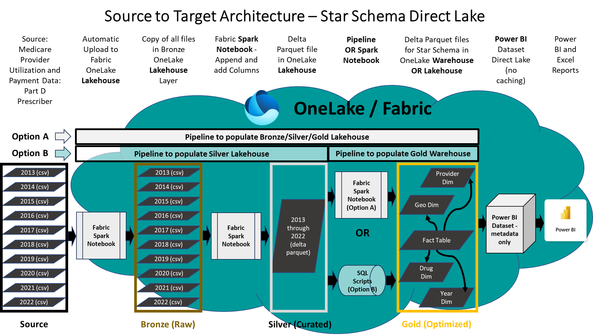

# Fabric Power BI Direct Lake Connector with 220M+ Rows

## Scenario
The Fabric Direct Lake connector is a new technology for querying delta parquet files from Power BI without data caching or an intermediary relational database. Power BI datasets have been modernized so that the semantic layer containing metadata and query logic can directly query the Fabric Data Lake. Data for the demo is 250 million rows of real healthcare data from the open data database titled **Medicare Part D Prescribers - by Provider and Drug**. Link here: https://data.cms.gov/provider-summary-by-type-of-service/medicare-part-d-prescribers/medicare-part-d-prescribers-by-provider-and-drug . An end-to-end demo of this solution module can be viewed at this link: https://youtu.be/2tLIGVZ4c8E 

## Scope
This demo is intended to provide experience with data engineering tasks using Fabric Spark and/or Data Pipelines to build out Delta Parquet tables and then use the Direct Lake connector in Power BI to query large volumes of real data. The medallion lakehouse architecture is followed in this sample where raw CSV files are loaded to Bronze Layer, then Silver Layer flat table built using Delta Parquet format and lastly Gold Layer tables serve up the star schema model for a Direct Lake Power BI dataset. 

### Pre-Requisite
Fabric enabled Workspace is the pre-requisite to be able to setup and end to end demonstration in your own environment. The instructions below are combination of Spark Notebook and a few manual steps to create Power BI Dataset and corresponding report.

***

## Steps to setup demo in your own environment

### Step 1: [Create Lakehouse and setup Spark Notebooks](./docs/1-CreateLakehouse-SetupSparkNotebooks.md) 

***

### Step 2: Download Raw Files and build out Silver and Gold Layer Tables (Star Schema) to be used for Reporting
**Two methods are documented and available for this step and only one of the two needs to be implemented.** The choice on which method to use is more of a preference based on your skill set. Microsoft Fabric is a broad platform and allows end users to pick tools of their preference hence choice here demonstrates verstaility of the platform. In this step Bronze, Silver and Gold Layers of Medallion architecture are built using slightly different methods, the biggest difference is whether Gold Layer Star Schema Tables to be used for reporting are created in a Lakehouse or a Warehouse. 

**Note**: Fabric Data Factory Pipeline implementation steps are manual for now but we will look into making it easier using automation in future. **Both options 2a and 2b are manual but Step 2a is going to be a little less effort to setup because it uses Spark Notebooks which can be easily imported for use in your Fabric workspace. Step 2b will require little extra effort to setup Pipeline activities for T-SQL execution**

**2a. Gold Layer in Fabric Lakehouse** - A Fabric Data Factory Pipeline is implemented to use Spark Notebooks for building out all three layers - Bronze, Silver and Gold Layers in a Fabric Lakehouse.

[Setup Pipeline with Gold Layer in Fabric Lakehouse](./docs/2a-SetupPipeline-GoldLayerFabricLakehouse.md)

Skip to Step 3 if Step 2a was chosen and successfully executed to create star schema tables.

**2b. Gold Layer in Fabric Warehouse** - Fabric Data Factory Pipeline is implemented to use Spark Notebooks for building Bronze and Silver Layers in a Lakehouse but T-SQL scripts for building out the final Gold Layer persisted in Fabric Warehouse.

You will need the Lakehouse name from Step 1 and if you used the suggested name **cms_lakehouse** it will be easier otherwise few edits in T-SQL scripts will be required.

[Setup Pipeline with Gold Layer in Fabric Warehouse](./docs/2b-SetupPipeline-GoldLayerFabricWarehouse.md)

***

### Step 3: [Create the Direct Lake Power BI Star Schema Semantic Model Dataset with DAX expressions and metadata](./docs/3-CreatePBISemanticModel.md) - ** Steps are manual at this time but in future plan to automate for quick setup**

***

### Step 4: [Create Reports using Power BI or Connect using Excel] - ** Steps are manual at this time but in future plan to automate for quick setup **

