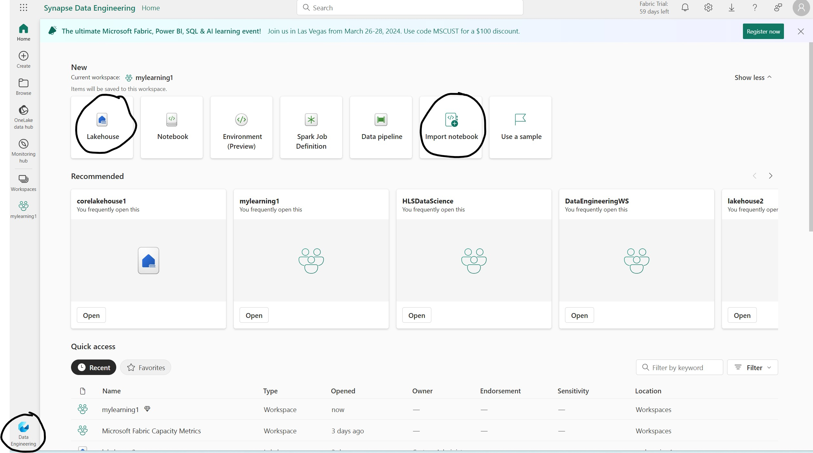
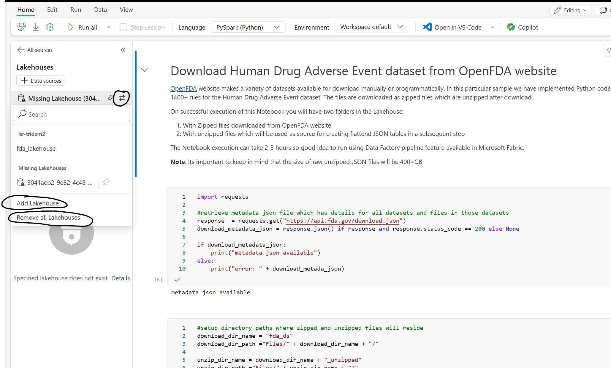
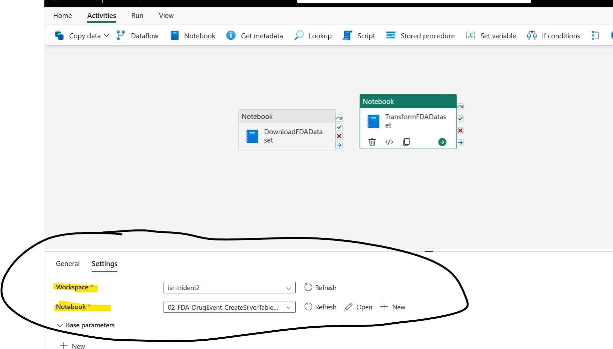
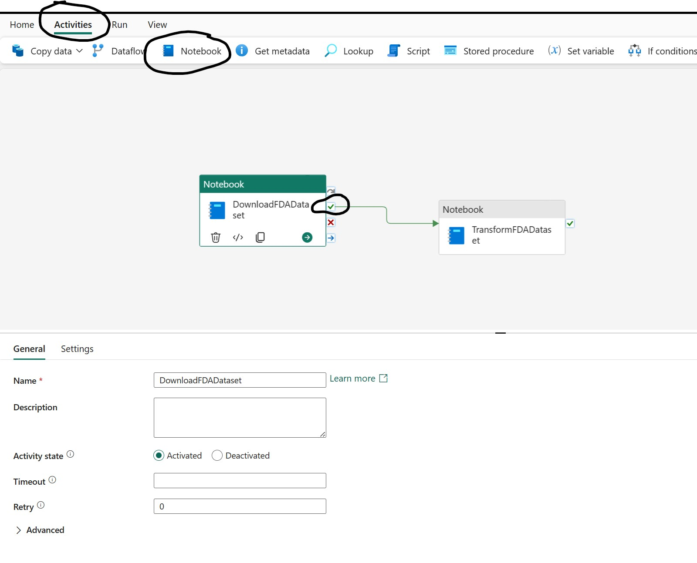

# Analytics over FDA Drug Adverse Event Dataset (1400+ Files, 400+ GB raw JSON data uncompressed) using Microsoft Fabric 

## Scenario
As part of the openFDA project FDA makes a variety of real world datasets publicly available. The goal of openFDA project as stated on [openFDA](https://open.fda.gov/about/) website is to "create easy access to public data, to create a new level of openness and accountability, to ensure the privacy and security of public FDA data, and ultimately to educate the public and save lives". In this module we will demonstrate Microsoft Fabric capabilities to ingest, transform and report on this relatively large and complex real world health care dataset. The idea is to showcase how Microsoft Fabric provides an end to end analytics platform that has been built with ease of use in mind to draw value out of data faster without solving technical component integration challenges. The dataset consists of 1400+ JSON files which amounts to 400+ GB raw data on disk and complex nested JSON structure not very conducive for anlaytics and reporting.

**Note**: Downloading of dataset is automated as part of the solution presented here so you don't need to download the dataset manually but showing the location of dataset on openFDA webiste for reference - https://open.fda.gov/data/downloads/ 

## Scope
[TODO: Scope including Architecture Diagram]

### Pre-Requisites
Fabric enabled Workspace is the pre-requisite to be able to setup an end to end demonstration in your own environment.

***

### Step 1: Create Lakehouse, import Spark Notebooks and setup the Lakehouse association for Spark Notebooks

In this step you will setup Lakehouse and Notebooks for downloading dataset to Files section of the Lakehouse

1. Open your Fabric Workspace and switch to Data Engineering persona using the menu on bottom left corner (the screenshot below shows the buttons for Lakehouse creation and Notebook Import for Steps 2 and 3) 
   
        

2. Create a new Lakehouse if not using an existing Lakehouse
3. Download [01-FDA-Download-DrugEvent-Dataset](./01-FDA-Download-DrugEvent-Dataset.ipynb) and [02-FDA-DrugEvent-CreateSilverTables](./02-FDA-DrugEvent-CreateSilverTables.ipynb) Spark Notebooks from Github Repo to your local machine
4. Import the two downloaded Notebooks into Fabric Workspace
5. Open **01-FDA-Download-DrugEvent-Dataset** Notebook, once the import is successful **update the Lakehouse association of the Notebook**
    
    

6. Repeat Step 5 for **02-FDA-DrugEvent-CreateSilverTables** Notebook

**Note**:

**01-FDA-Download-DrugEvent-Dataset** Spark Notebook has the code to download and unzip all 1400+ dataset files which zipped JSON files 

**02-FDA-DrugEvent-CreateSilverTables** Spark Notebook uses raw JSON files (downloaded using the first Spark Notebook) as source and creates flattened tables more conducive to reporting and analytics.

Both Notebooks have markdown cells as well as inline comments to describe the code for better understanding of the solution. At this point you are ready to move onto the next step of creation of Data Pipeline to run these Notebooks as a non-interactive job.

***

### Step 2: Build Pipeline to ingest and transform Drug Adverse Event Dataset into flattened Relational Tables

In this step you will create a Data Pipeline to execute the previously imported Spark Notebooks
1. Open **01-FDA-Download-DrugEvent-Dataset** Notebook
2. Open the *Run* options by clicking **Run** button in the toolbar 
3. Clck **Add to Pipeline** button and select **New Pipeline** option
   
    

4. Specify Pipeline Name and click Create button to open Data Pipeline canvas
5. Select the Notebook Activity on canvas to give appropriate name like *DownloadFDADataset* to the Activity as shown in the screenshot below but besides that review the Settings table for activity (Workspace and Notebook settings are automatically set appropriately becuase Pipeline was created from Notebook)
   
    

6. Open the *Activity* menu by clicking **Activity** button in the Toolbar
7. Click **Notebook** button which will add a new Notebook activity on the canvas
   
    
    
8. Select the new Notebook Activity on the canvas and open Settings section
   
   

9.  Set the Workspace value to the current Workspace
10. Set the Notebook value to **02-FDA-DrugEvent-CreateSilverTables**
11. Connect the two Activities by dragging from the Download Activity On Success icon to the Transform Activity added for second Notebook
   
    

12. Make sure to save changes to the Pipeline

***

### Step 3: Run Pipeline

In this step you will run the Pipeline created in Step 2. The Pipeline job can take a few hours to execute so you can kick off the Pipeline execution and check back after hours to see the execution status, it will execute in the background and there is no need to keep your Microsoft Fabric session open.

1. Make sure you have saved Pipeline changes and then click the **Run** button from Home menu as shown in the screenshot below

2. It will take the Pipeline Job a few hours to run and you can monitor execution status of the job from Monitoring Hub, screenshot below shows successful run of the Pipline Job

Once the Job completes successfully you can browse to the Lakehouse to see the three tables as well as two folders in the files section of Lakehouse for zipped and unzipped raw files as shown in the screenshot below.

