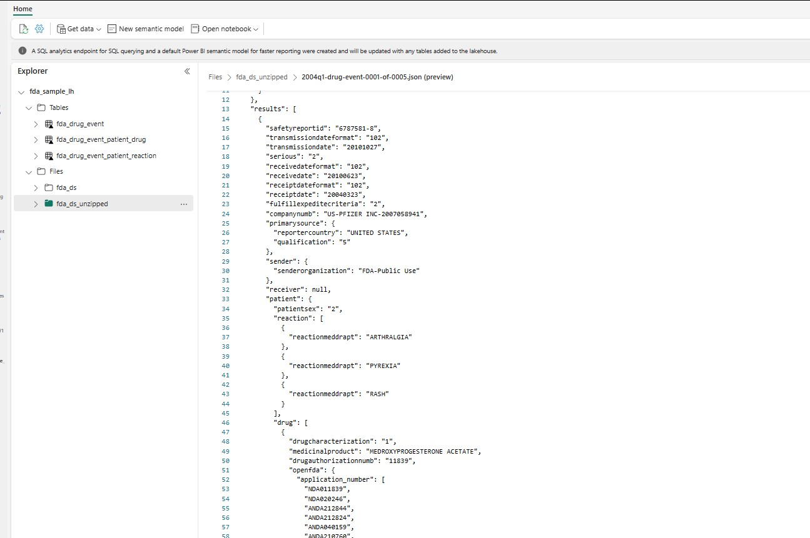
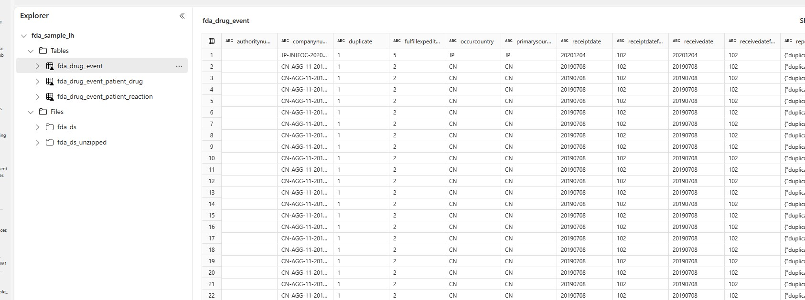

# Analytics over FDA Drug Adverse Event Dataset (1400+ Files, 400+ GB raw JSON data uncompressed) using Microsoft Fabric 

## Scenario
As part of the openFDA project FDA makes a variety of real world datasets publicly available. The goal of openFDA project as stated on [openFDA](https://open.fda.gov/about/) website is to "create easy access to public data, to create a new level of openness and accountability, to ensure the privacy and security of public FDA data, and ultimately to educate the public and save lives". In this module we will demonstrate Microsoft Fabric capabilities to ingest, transform and report on this relatively large and complex real world health care dataset. The idea is to showcase how Microsoft Fabric provides an end to end analytics platform that has been built with ease of use in mind to draw value out of data faster without solving technical component integration challenges. The dataset consists of 1400+ JSON files which amounts to 400+ GB raw data on disk and complex nested JSON structure not very conducive for anlaytics and reporting.

**Note**: Downloading of dataset is automated as part of the solution presented here so you don't need to download the dataset manually but showing the location of dataset on openFDA webiste for reference - https://open.fda.gov/data/downloads/ 

***

## Solution Overview
[TODO: Overview including Architecture Diagram]

The Human Drug Adverse Event Dataset consists of 1400+ files and 400+GB representing data from over 20 years. The data in files has complex nested JSON structure which is flattened into relational tables using Spark Notebooks. 

The following screenshot shows one of the source files as an example source file which is the input transformed into relational flattened tables by Spark Notebook.

The following screenshot gives a glimpse of the output in the Lakehouse after the first three steps are successfully completed to download and flatten the data into relational tables in Silver Layer of Medallion Architecture.

## Pre-Requisites
Fabric enabled Workspace is the pre-requisite to be able to setup an end to end demonstration in your own environment.

***

## Steps to setup demo in your own environment

This section lists the links to pages with step by step by instructions, Step 1 to Step 3 shouldn't take more than 10 to 15 minutes to setup but have been broken into distinct steps for clarity.

1. [Create Lakehouse, import Spark Notebooks and setup the Lakehouse association for Spark Notebooks](./docs/01-CreateLakehouse-SetupNotebooks.md)
2. [Create Pipeline to ingest and transform Drug Adverse Event Dataset into flattened Relational Tables](./docs/02-CreatePipeline.md)
3. [Run Pipeline to generate flattened relation tables in Silver Layer of Medallion Architecture](./docs/03-RunPipeline.md)

