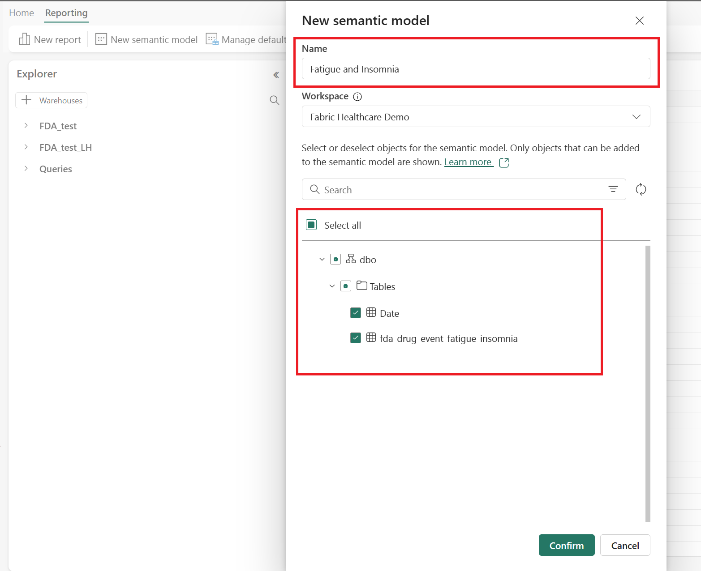
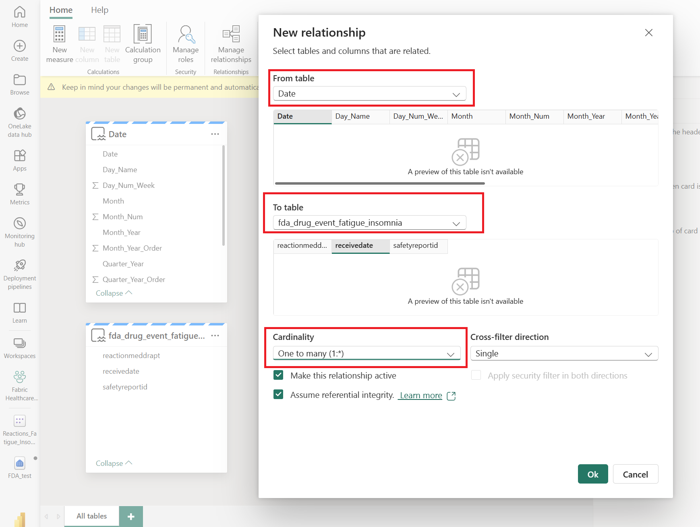

## Create Fabric Semantic Model for Direct Lake connectivity from Power BI

Now you will create a Semantic Model that enables a custom Direct Lake connection from Power BI. This example is vey simple, but you can learn from the methodology and add more data from either the OpenFDA dataset or other data that you bring into Fabric.

1. From your Fabric Warehouse select **Reporting** > **New Semantic Model** as seen in the screenshot below:

2. Name the Semnatic Model and select the tables you'd like to include. I've included the two simple tables from the previous page:

3. Press **Confirm**. Navigate back to your Fabric Workspace, find the new Semantic Model, click the ellipse, and select **Open data model** as seen below:

4. If you are familiar with Power BI, you are now in a familiar Semantic Model editing screen! In the screenshot below I am adding a relationship using the Date columns from both tables added to the Warehouse on the previous page:

5. The process for creating a Direct Lake Semantic Model is also reviewed in a video from another module in this Git Repo: https://youtu.be/8K4vvy_o9j0

Moving forward, you can add new tables, update the Semantic Model, and then build reports in Power BI! If you'd like to see more detailed examples for this level of the solution, please pass along suggestions.

[Home](../Readme.md) | [Prevous](./03-RunPipeline.md) | Next
